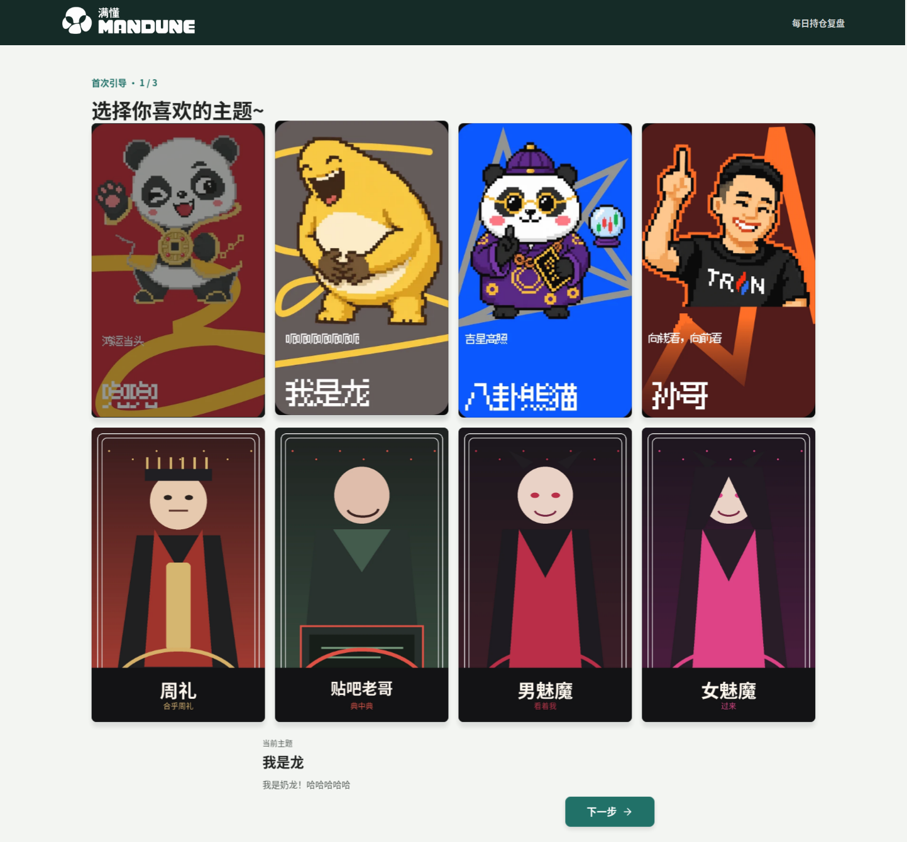
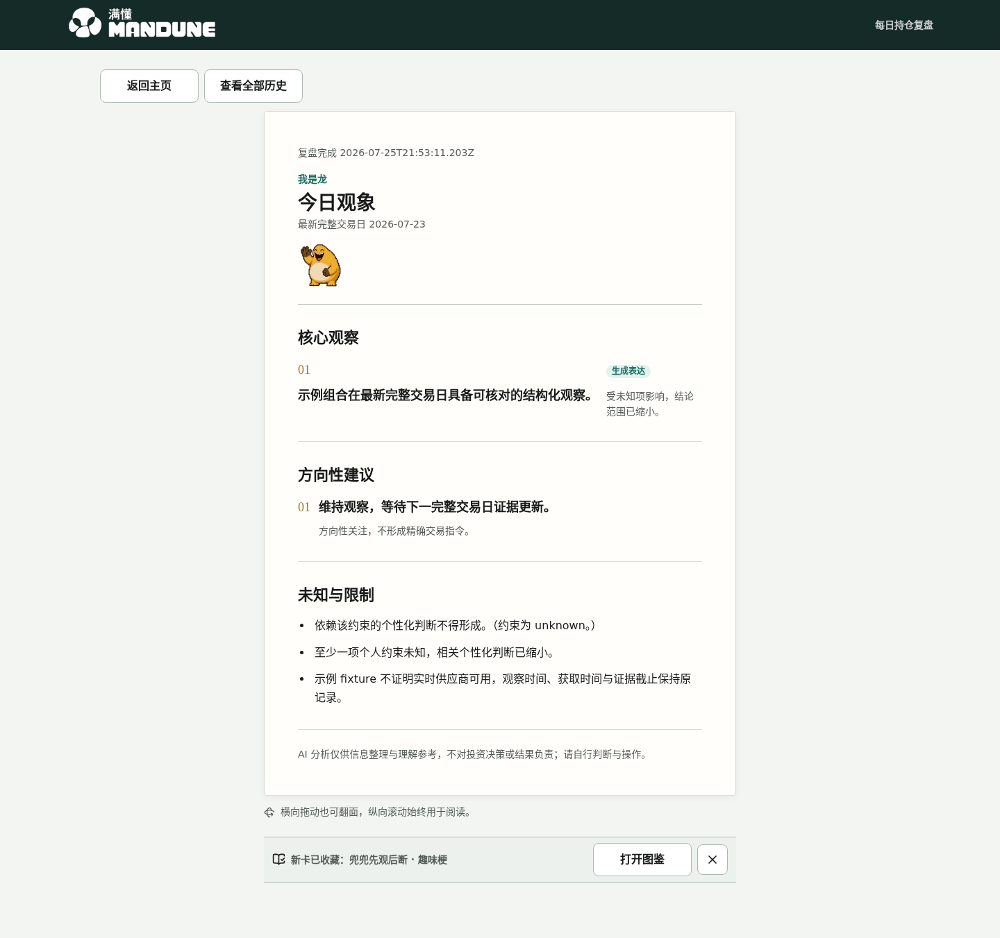
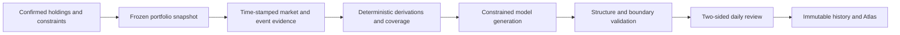

# Mandune

<div align="center">
  
  <p><strong>A daily portfolio review that keeps the story readable and the evidence inspectable.</strong></p>
  <p>
    <a href="https://mandune.wuxie233.com"><strong>Production site</strong></a> ·
    <a href="https://expo.wuxie233.com"><strong>Live exhibition data</strong></a> ·
    <a href="README.md">简体中文</a> ·
    <a href="docs/architecture.md">Architecture</a> ·
    <a href="CONTRIBUTING.md">Contributing</a>
  </p>
</div>



Mandune turns a confirmed portfolio, personal constraints, optional valuation and cost inputs, and time-stamped evidence into a two-sided daily review. The front can use any of seven character themes. The back preserves the matching inputs, evidence cutoff, coverage, unknowns, and limitations. Short-term observations use the latest three valid sessions, mid-term observations use roughly one month, and long-term risk uses up to one year. A theme may change the voice, but it cannot change the rational result or its risk boundaries.

Mandune was built for **AdventureX 2026**, in the Portfolio Agent direction of PandaAI's “Build the Next AI Trader” track. It remains a self-hostable early-stage project after the hackathon. It is not a broker, licensed adviser, or automated trading system.

## What It Includes

- Anonymous workspaces with a 30-day inactivity lifetime and user-requested deletion.
- Manual multi-holding entry and local OCR that produces an editable, unconfirmed draft.
- Optional total value, cash, per-holding market value, and cost inputs; missing amounts do not block directional analysis.
- Portfolio reviews for funds, ETFs, and A-share instruments across short, mid, and long market windows.
- Seven themed front sides backed by the same rational report, evidence, unknowns, and risk boundaries.
- A pre-generated daily market briefing with an explicit briefing date, market cutoff, and sources.
- A deterministic ten-point portfolio tier card when all required market horizons are available; the share image omits holding names and symbols.
- Server-sent task and generation progress. The default `stream` path publishes a complete non-empty response; strict `v2` additionally validates structured output, references, and report boundaries.
- Immutable history replay that does not silently recompute old conclusions.
- An Atlas of learning cards generated from validated reviews.
- OpenAI-compatible and Anthropic Messages gateways with ordered fallbacks.
- An optional authenticated A2A 1.0 deep-review agent and public Agent Card.
- A public exhibition dashboard with daily anonymous visit and service-use counters.
- A single-host Node.js, SQLite, systemd, and Nginx deployment contract.

> [!IMPORTANT]
> Mandune provides traceable, directional information only. It may review user-confirmed holding amounts and realized historical impact, but it does not prescribe exact trade amounts, shares, target allocations, prices, trade timing, return guarantees, or transaction execution.

## Product View

<p align="center">
  
</p>

The screenshot uses fictional repository fixtures and contains no real account data.

## Exhibition Display

The live exhibition dashboard is available at <https://expo.wuxie233.com>. It shows the Shanghai-time daily anonymous visit count, workspace creations, and newly accepted reviews alongside a QR code for the production site.

- Visits are counted once per anonymous browser per day without storing IP addresses.
- Service use equals successful workspace creations plus newly accepted review starts.
- QR image download: <https://expo.wuxie233.com/mandune-qr.png>

## How It Works



The default `stream` mode asks an isolated AKShare worker for fund, ETF, and A-share daily data, falls back per instrument to the public Tencent adapter when needed, and performs one streaming model generation for the two-sided report body. `stream` publishes a complete non-empty response and uses bounded markers to split the rational and themed sides when present; strict structural, reference, and risk-boundary validation belongs to `v2`. “One model call” refers only to the report body: Atlas may make an independent non-blocking follow-up gateway request after the report is saved. Strict `v2` adds PandaAI batch collection, cached Bocha event evidence, a deterministic ReviewPacket, and structured generation. With no model configured, a non-production server uses clearly marked fixtures.

The waiting-page briefing is separate from portfolio analysis. It pre-generates seven themed copies from one public market fact sheet and never reads a workspace or portfolio. See [Daily briefing pipeline](docs/daily-briefing-pipeline.md).

See [Architecture](docs/architecture.md) for module and trust boundaries.

## Quick Start

Mandune requires Node.js `>=22 <23` and pnpm `10.33.2`.

```sh
git clone https://github.com/FinLens-team/Mandune.git
cd Mandune
pnpm install --frozen-lockfile

mkdir -p .localdata/daily-briefings
cp .env.example .env
# Set MANDONG_DB_PATH and MANDONG_DAILY_BRIEFINGS_DIR to absolute paths under .localdata.

pnpm build
node --env-file-if-exists=.env dist/server/index.js
```

Open `http://127.0.0.1:8787`. The fixture path works without provider credentials. The local exhibition display is at `http://127.0.0.1:8787/expo`. For development, run `pnpm dev:server` and `pnpm dev` in separate terminals.

Configuration details are documented in [docs/configuration.md](docs/configuration.md).

## Verification

```sh
pnpm check
pnpm test
pnpm build
pnpm test:e2e       # requires E2E_TARGET_URL
./deploy/validate.sh
```

The browser suite covers desktop and a `375 × 812` mobile viewport, runtime failures, horizontal overflow, and sensitive-data exposure. Deployment validation covers reproducible archives, unsafe archive entries, shared maintenance locks, and SQLite rollback recovery.

## Stack

- React 19 and Vite 7
- Hono on Node.js 22
- strict TypeScript
- Node.js built-in `node:sqlite`
- Vercel AI SDK Core
- Vitest and Playwright
- Nginx and systemd for single-host deployment

## Privacy and Safety

- Provider credentials are server-only and never belong in `VITE_*`, browser bundles, logs, or `/health`.
- Workspaces use an `HttpOnly`, `Secure`, `SameSite=Lax` locator cookie instead of a URL secret.
- Inactive workspaces expire after 30 days and can be deleted earlier by the user.
- History replay reads the saved snapshot, evidence, result, and versions without silently using later data.
- Screenshot import requires explicit consent and runs through the local OCR boundary. It returns an unconfirmed editable draft, deletes the raw image after success, failure, timeout, or cancellation, and requires line-by-line confirmation before snapshot creation.
- Score share images contain the tier, score, dimensions, role, and roast only; they omit holding names, symbols, amounts, and account data.

Report vulnerabilities privately according to [SECURITY.md](SECURITY.md).

The public daily metrics API is `GET https://mandune.wuxie233.com/api/metrics/today`. It exposes aggregate counters only and never returns workspace, portfolio, review, or identity data.

## AdventureX 2026

The PandaAI track asks for a discoverable and callable A2A Remote Agent. Mandune's optional competition module exposes a public Agent Card, an authenticated message endpoint, a bounded tool loop, traceable evidence, explicit unknowns, and a server-owned risk notice. These are implementation facts, not an endorsement by AdventureX, PandaAI, or a financial institution.

## Project Status

Mandune is a working, self-hostable hackathon project. The production site, manual entry, local OCR drafts, seven themed reports, score share cards, and exhibition dashboard all have implementations. Current priorities are broader OCR coverage, operational monitoring and recovery for the app and briefing timer, more evidence and verifiable-news adapters with explicit degradation, and more privacy-safe validation of amount-aware reviews, scoring boundaries, and long-report completeness.

## Contributing

Read [CONTRIBUTING.md](CONTRIBUTING.md) before proposing a change. Use the repository templates for bugs and feature requests, [SUPPORT.md](SUPPORT.md) for usage questions, and [CODE_OF_CONDUCT.md](CODE_OF_CONDUCT.md) for community expectations.

## License and Assets

Original source code is licensed under [Apache License 2.0](LICENSE). Character likenesses, references to real people, trademarks, and selected visual assets listed in [ASSETS.md](ASSETS.md) and [NOTICE](NOTICE) are not licensed under the code license. Replace them or obtain the necessary permissions before reuse or redistribution. Derived Google Noto Emoji previews remain under their bundled Apache-2.0 license.

Mandune is not affiliated with AdventureX, PandaAI, Nailong, Justin Sun, or any other third-party brand or person unless explicitly stated in writing.
