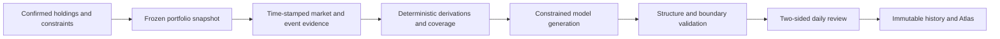

# Mandune

<div align="center">
  
  <p><strong>A daily portfolio review that keeps the story readable and the evidence inspectable.</strong></p>
  <p>
    <a href="https://mandune.wuxie233.com"><strong>Production site</strong></a> ·
    <a href="https://expo.wuxie233.com"><strong>Live exhibition data</strong></a> ·
    <a href="README.md">简体中文</a> ·
    <a href="docs/architecture.md">Architecture</a> ·
    <a href="CONTRIBUTING.md">Contributing</a>
  </p>
</div>


Mandune turns a confirmed portfolio, four personal constraints, and time-stamped evidence into a daily review that can be read from two sides. The front presents a themed narrative. The back preserves the matching inputs, evidence cutoff, coverage, unknowns, and limitations. A theme may change the voice, but it cannot change the rational result or its risk boundaries.

Mandune was built for **AdventureX 2026**, in the Portfolio Agent direction of PandaAI's “Build the Next AI Trader” track. It remains a self-hostable early-stage project after the hackathon. It is not a broker, licensed adviser, or automated trading system.

## What It Includes

- Anonymous workspaces with a 30-day inactivity lifetime and user-requested deletion.
- Portfolio reviews for funds, ETFs, and a limited set of A-share instruments.
- Time-stamped market and event evidence with explicit partial-failure states.
- A two-sided report: themed explanation on the front, matching evidence on the back.
- Server-sent streaming progress and publication only after result validation.
- Immutable history replay that does not silently recompute old conclusions.
- An Atlas of learning cards generated from validated reviews.
- OpenAI-compatible and Anthropic Messages gateways with ordered fallbacks.
- An optional authenticated A2A 1.0 deep-review agent and public Agent Card.
- A public exhibition dashboard with daily anonymous visit and service-use counters.
- A single-host Node.js, SQLite, systemd, and Nginx deployment contract.

> [!IMPORTANT]
> Mandune provides traceable, directional information only. It does not provide exact amounts, allocation percentages, prices, trade timing, return guarantees, or transaction execution.

## Product View

<p align="center">
  
</p>

The screenshot uses fictional repository fixtures and contains no real account data.

## Exhibition Display

The live exhibition dashboard is available at <https://expo.wuxie233.com>. It shows the Shanghai-time daily anonymous visit count, workspace creations, and newly accepted reviews alongside a QR code for the production site.

- Visits are counted once per anonymous browser per day without storing IP addresses.
- Service use equals successful workspace creations plus newly accepted review starts.
- QR image download: <https://expo.wuxie233.com/mandune-qr.png>

## How It Works



The default `stream` mode combines a public market source with one streaming model generation. Strict `v2` mode adds PandaAI batch collection, cached Bocha event evidence, a deterministic ReviewPacket, and structured output validation. With no model configured, the server uses clearly marked fixtures for local evaluation and tests.

See [Architecture](docs/architecture.md) for module and trust boundaries.

## Quick Start

Mandune requires Node.js `>=22 <23` and pnpm `10.33.2`.

```sh
git clone https://github.com/FinLens-team/Mandune.git
cd Mandune
pnpm install --frozen-lockfile

mkdir -p .localdata
cp .env.example .env
# Set MANDONG_DB_PATH in .env to an absolute path under .localdata.

pnpm build
pnpm start
```

Open `http://127.0.0.1:8787`. The fixture path works without provider credentials. The local exhibition display is at `http://127.0.0.1:8787/expo`. For development, run `pnpm dev:server` and `pnpm dev` in separate terminals.

Configuration details are documented in [docs/configuration.md](docs/configuration.md).

## Verification

```sh
pnpm check
pnpm test
pnpm build
pnpm test:e2e       # requires E2E_TARGET_URL
./deploy/validate.sh
```

The browser suite covers desktop and a `375 × 812` mobile viewport, runtime failures, horizontal overflow, and sensitive-data exposure. Deployment validation covers reproducible archives, unsafe archive entries, shared maintenance locks, and SQLite rollback recovery.

## Stack

- React 19 and Vite 7
- Hono on Node.js 22
- strict TypeScript
- Node.js built-in `node:sqlite`
- Vercel AI SDK Core
- Vitest and Playwright
- Nginx and systemd for single-host deployment

## Privacy and Safety

- Provider credentials are server-only and never belong in `VITE_*`, browser bundles, logs, or `/health`.
- Workspaces use an `HttpOnly`, `Secure`, `SameSite=Lax` locator cookie instead of a URL secret.
- Inactive workspaces expire after 30 days and can be deleted earlier by the user.
- History replay reads the saved snapshot, evidence, result, and versions without silently using later data.
- Screenshot import is not enabled in the current UI. Its extraction boundary requires raw screenshots to be deleted after success, failure, or cancellation.

Report vulnerabilities privately according to [SECURITY.md](SECURITY.md).

The public daily metrics API is `GET https://mandune.wuxie233.com/api/metrics/today`. It exposes aggregate counters only and never returns workspace, portfolio, review, or identity data.

## AdventureX 2026

The PandaAI track asks for a discoverable and callable A2A Remote Agent. Mandune's optional competition module exposes a public Agent Card, an authenticated message endpoint, a bounded tool loop, traceable evidence, explicit unknowns, and a server-owned risk notice. These are implementation facts, not an endorsement by AdventureX, PandaAI, or a financial institution.

## Project Status

Mandune is a working, self-hostable hackathon project with its production site and exhibition dashboard online. The next priorities are enabling confirmed manual and screenshot-based input, strengthening operational recovery, expanding evidence adapters, and validating the report boundary with more privacy-safe scenarios.

## Contributing

Read [CONTRIBUTING.md](CONTRIBUTING.md) before proposing a change. Use the repository templates for bugs and feature requests, [SUPPORT.md](SUPPORT.md) for usage questions, and [CODE_OF_CONDUCT.md](CODE_OF_CONDUCT.md) for community expectations.

## License and Assets

Original source code is licensed under [Apache License 2.0](LICENSE). Character likenesses, references to real people, trademarks, and selected visual assets listed in [ASSETS.md](ASSETS.md) and [NOTICE](NOTICE) are not licensed under the code license. Replace them or obtain the necessary permissions before reuse or redistribution. Derived Google Noto Emoji previews remain under their bundled Apache-2.0 license.

Mandune is not affiliated with AdventureX, PandaAI, Nailong, Justin Sun, or any other third-party brand or person unless explicitly stated in writing.
