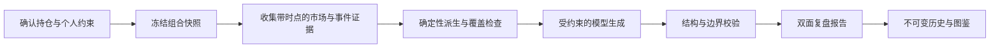

<div align="center">
  
  <p><strong>数据有剧情，复盘不无聊。</strong></p>
  <p>把持仓、个人约束和带时点证据，整理成一份能读、能核对、能回看的每日复盘。</p>
  <p>
    <a href="https://mandune.wuxie233.com"><strong>正式站</strong></a> ·
    <a href="https://expo.wuxie233.com"><strong>展会实时数据</strong></a> ·
    <a href="README.en.md">English</a> ·
    <a href="docs/architecture.md">架构</a> ·
    <a href="CONTRIBUTING.md">参与贡献</a>
  </p>
  <p>
    
    
    
    <a href="LICENSE"></a>
  </p>
</div>


## 为什么做 Mandune

轻投资者每天看到的是涨跌、新闻和情绪，却很难把它们放回自己的持仓结构与风险边界里。Mandune（满懂）从用户确认的基金、ETF 和 A 股持仓出发，结合个人约束、可选的持仓市值与成本，以及最新完整交易日的证据，生成一份方向性复盘。

报告正面可以切换七种角色主题，背面保留同一版本的输入、证据时点、覆盖范围、未知项与限制。短期看最近三个有效交易日，中期看近一个月，长期风险参考近一年；叙事可以变化，理性结论和风险边界不能跟着角色变化。

Mandune 是 **AdventureX 2026** 黑客松作品，对应 PandaAI「Build the Next AI Trader」赛道的 Portfolio Agent 方向。项目在比赛场景之外仍按可自托管应用维护，但它不是券商、投顾或自动交易系统。

## 产品能力

| 能力 | 当前实现 |
| --- | --- |
| 匿名体验 | 无需账号创建私密工作区，可生成多标的虚构组合并随时换一份 |
| 持仓录入 | 支持手动录入多项持仓，也可用本机 OCR 生成逐项确认的可编辑草稿 |
| 金额复盘 | 可选填写持仓总市值、现金、逐项当前市值与成本；缺失金额不阻断方向性分析 |
| 持仓复盘 | 对基金、ETF 和 A 股持仓做短期、中期、长期行情派生与证据约束分析 |
| 双面报告 | 七种角色正面共享同一份理性背面、证据、未知与风险边界 |
| 盘前日报 | 每日预生成七主题公开市场简报，明确日报日期、行情截止日和来源 |
| 组合评分 | 行情周期齐全时生成确定性十分制段位卡，可导出不含持仓名称和代码的分享图 |
| 实时进度 | 通过任务事件与 SSE 展示行情收集和模型生成进度；默认 `stream` 发布完整非空结果，严格 `v2` 另做结构化、引用与边界校验 |
| 不可变历史 | 保存当时的快照、证据、结果和版本，回看时不使用后来数据重算 |
| 满懂图鉴 | 从已校验复盘中生成知识卡，保留首次出现与复遇记录 |
| 多模型网关 | 支持 OpenAI-compatible、Anthropic Messages 和有序 fallback |
| A2A Agent | 提供公开 Agent Card 与 Bearer 鉴权的 A2A 1.0 深度复盘入口 |
| 展会实时数据 | 公开展示今日匿名访问、工作区创建与新复盘启动数据，并提供扫码入口 |
| 自托管 | Node 22 + SQLite 单机部署，附 Nginx、systemd、发布与回滚脚本 |

> [!IMPORTANT]
> Mandune 只提供可追溯的方向性信息整理，可以回顾用户确认的持仓金额与已发生影响，但不给出精确交易金额、份额、目标比例、价格、交易时点或收益保证，也不连接券商和执行交易。

## 真实界面

<p align="center">
  
</p>

截图使用仓库内的虚构 fixture，不包含真实账户或个人金融数据。

## 展会现场

展会数据屏：<https://expo.wuxie233.com>。左侧显示上海时区当天的实时数据，右侧二维码指向正式站。统计从当天统计功能上线后开始累计，访问按匿名浏览器每日去重。

| 数据 | 口径 |
| --- | --- |
| 今日访问 | 每个匿名浏览器每天计 1 次，不保存 IP |
| 今日服务使用 | 成功创建工作区次数 + 新复盘成功受理次数 |

直接下载体验二维码：<https://expo.wuxie233.com/mandune-qr.png>

## 工作方式



默认 `stream` 模式先通过隔离的 AKShare worker 获取基金、ETF 与 A 股日线，失败或数据不足时逐项回退到腾讯公开行情源，再进行一次双面报告正文的流式模型生成。`stream` 发布完整非空文本，并在存在边界标记时拆分理性面和主题面；严格的结构化、引用和风险边界校验属于 `v2`。这里的“一次模型调用”只指报告正文，报告完成后 Atlas 仍可能作为独立的非阻塞后置任务再次调用模型网关。

等待页日报与持仓复盘是两条独立链路。日报每天预生成七个主题版本，只使用其事实底稿中的公开市场信息，不读取工作区或持仓；详情见 [日报流水线](docs/daily-briefing-pipeline.md)。

完整模块与信任边界见 [架构文档](docs/architecture.md)。

## 快速开始

### 环境要求

- Node.js `>=22 <23`
- pnpm `10.33.2`
- Linux、macOS 或可运行上述工具的开发环境

### 本地体验

```sh
git clone https://github.com/FinLens-team/Mandune.git
cd Mandune
pnpm install --frozen-lockfile

mkdir -p .localdata/daily-briefings
cp .env.example .env
# 将 MANDONG_DB_PATH 和 MANDONG_DAILY_BRIEFINGS_DIR 改为 .localdata 下对应目录的绝对路径

pnpm build
node --env-file-if-exists=.env dist/server/index.js
```

打开 `http://127.0.0.1:8787`。不配置 `MODEL_*` 时会进入 fixture 模式，不需要供应商凭据。展会屏本地路径为 `http://127.0.0.1:8787/expo`。

开发时分别运行：

```sh
pnpm dev:server
pnpm dev
```

Vite 客户端默认使用 `5173` 端口。完整环境变量说明见 [配置文档](docs/configuration.md)。

## 验证

```sh
pnpm check       # ESLint + 三套 TypeScript 配置
pnpm test        # Vitest
pnpm build       # 客户端与服务端生产构建
pnpm test:e2e    # 需要显式提供 E2E_TARGET_URL
./deploy/validate.sh
```

E2E 同时覆盖桌面端与 `375 × 812` 移动视口，并检查横向溢出、运行时错误和敏感字段暴露。部署校验还覆盖发布包可复现性、归档路径安全、共享维护锁与 SQLite 回滚恢复。

## 技术栈

- React 19 + Vite 7
- Hono on Node.js 22
- strict TypeScript
- Node.js 内置 `node:sqlite`
- Vercel AI SDK Core
- Vitest + Playwright
- Nginx + systemd 单机发布方案

## 隐私与数据边界

- 模型和供应商凭据只从服务端环境读取，不进入 `VITE_*`、浏览器包、日志或 `/health`。
- 工作区通过 `HttpOnly`、`Secure`、`SameSite=Lax` Cookie 定位，不把定位凭据放进 URL。
- 工作区连续 30 天无活动后自动删除，也可由用户主动注销。
- 历史回放只读取当时保存的输入、证据和结果。
- 截图识别必须先取得用户同意，只在本机 OCR 边界生成未确认草稿；原图在成功、失败、超时或中止后删除，用户逐项确认后才能进入组合快照。
- 评分分享图只使用段位、分数、维度、角色和吐槽文案，不包含持仓名称、证券代码、金额或账户信息。

安全问题请按 [安全策略](SECURITY.md) 私下报告，不要提交公开 Issue。

## 部署

生产部署采用单个 Node 进程、一个本地 SQLite 数据库、systemd 守护和 Nginx HTTPS 反向代理。独立 systemd timer 每天在上海时间 08:00 后随机延迟最多 5 分钟生成等待页日报，并原子发布到持久运行时目录。发布脚本使用不可变 commit 目录、归档白名单、SHA-256 校验、迁移前数据库备份、健康检查和一步回滚。

操作步骤见 [部署文档](docs/deployment.md) 和 [`deploy/README.md`](deploy/README.md)。

今日展会数据 API 为公开聚合接口：

```sh
curl --fail --silent https://mandune.wuxie233.com/api/metrics/today | jq .
```

接口只返回当天的访问、工作区创建、新复盘启动和服务使用次数，不返回工作区、持仓、复盘内容或任何身份信息。

## AdventureX 2026

PandaAI 赛道要求以可发现、可调用的 A2A Remote Agent 交付。Mandune 的可选 A2A 模块提供：

- `/.well-known/agent-card.json` 公开 Agent Card；
- `/a2a/message:send` Bearer 鉴权入口；
- 最多 8 步的受控工具循环与 15 分钟硬截止；
- 可追溯的工具记录、证据来源、未知项和服务端固定风险提示；
- 对私密字段、未授权数据和超限请求的拒绝路径。

这些能力用于说明参赛实现，不代表 PandaAI、AdventureX 或任何金融机构对本项目的认可或背书。

### 调用 A2A Agent

线上 Agent 使用 A2A `1.0` 的 HTTP+JSON 绑定：

- Agent Card：<https://mandune.wuxie233.com/.well-known/agent-card.json>
- 接口基址：`https://mandune.wuxie233.com/a2a`
- 消息入口：`POST /a2a/message:send`

先读取 Agent Card，确认接口、协议版本、输入输出模式和鉴权方式：

```sh
curl --fail --silent \
  https://mandune.wuxie233.com/.well-known/agent-card.json | jq .
```

消息接口需要服务端分配的独立 Bearer Token。把 Token 放在请求头中，不要写进 URL、客户端代码或提交记录：

```sh
export MANDUNE_A2A_TOKEN='<your-bearer-token>'

curl --fail --silent \
  --request POST \
  https://mandune.wuxie233.com/a2a/message:send \
  --header 'Content-Type: application/a2a+json' \
  --header 'A2A-Version: 1.0' \
  --header "Authorization: Bearer ${MANDUNE_A2A_TOKEN}" \
  --data '{
    "message": {
      "role": "ROLE_USER",
      "messageId": "example-context-review-1",
      "parts": [
        {
          "text": "请总结本次任务的已知上下文、未知项和需要补充的信息，不要假设持仓。",
          "mediaType": "text/plain"
        }
      ]
    },
    "configuration": {
      "acceptedOutputModes": ["text/plain", "application/json"]
    }
  }' | jq .
```

成功响应包含一个 `ROLE_AGENT` Message。文本 Part 用于直接展示，JSON Part 包含证据、数据来源、确定性派生、工具轨迹、未知项、限制和固定风险提示。提交通过契约校验的 `PortfolioSnapshot` Data Part 后，Agent 可为快照内支持的资产查询 PandaAI 授权结构化行情；未提供快照时不会推测持仓或查询快照外资产。

当前入口是非流式、无状态的一次性深度复盘，不支持任务续写、推送通知或交易执行。请求必须携带 `A2A-Version: 1.0`；缺失版本头会按 `0.3` 处理并返回版本不支持错误。

## 项目状态

Mandune 是一个可运行、可自托管的黑客松作品，正式站、手动持仓录入、本机 OCR 草稿、七主题复盘、评分分享卡与展会数据页均已有实现。当前优先事项是：

- 扩充 OCR 对更多券商截图布局和金额字段的识别覆盖；
- 完善自托管部署的可观测性、日报运行监控与恢复演练；
- 扩展证据提供方和可核验新闻采集，并保持供应商故障时的显式降级；
- 用更多真实但脱敏的组合验证金额复盘、评分边界和长报告完整性。

## 贡献

提交改动前请阅读 [CONTRIBUTING.md](CONTRIBUTING.md) 和 [CODE_OF_CONDUCT.md](CODE_OF_CONDUCT.md)。功能请求和缺陷可以使用仓库 Issue 模板；使用问题见 [SUPPORT.md](SUPPORT.md)。

## 许可与资产

项目自有源代码以 [Apache License 2.0](LICENSE) 发布。[资产许可清单](ASSETS.md)与 `NOTICE` 中列出的角色形象、人物指代、商标和部分视觉资产不随代码许可授权；复用或再发布前，请替换这些资产或自行取得必要许可。Google Noto Emoji 衍生预览图按其随附的 Apache-2.0 文本授权。

“Mandune / 满懂”与 AdventureX、PandaAI、奶龙、孙宇晨及其他第三方品牌或人物不存在隶属关系，除非另有明确书面说明。
