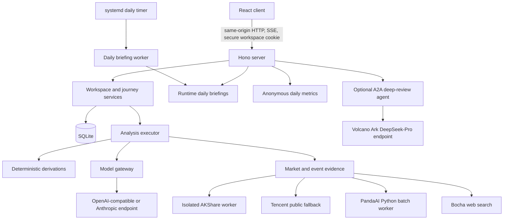

# Mandune Architecture

This document describes the current runtime boundaries. Source code and tests remain authoritative when this overview and implementation differ.

## System Shape

Mandune is a single-package TypeScript application. Vite builds the React client into `dist/client`; TypeScript builds the Hono server into `dist/server`. One Node.js process serves the API, static assets, and SPA fallback. Durable state lives in one SQLite database opened before the server binds its port.

## Module Boundaries

| Path | Responsibility |
| --- | --- |
| `src/client/` | React entry point, shared UI primitives, client assets |
| `src/features/` | User-facing slices: onboarding, workspace, progress, report, history, Atlas, about |
| `src/contracts/` | Versioned framework-neutral contracts and pure validators |
| `src/app/client/` | Journey state machine, persistence adapter, and HTTP/SSE gateway |
| `src/app/server/` | Analysis routes, task lifecycle, executors, and stream delivery |
| `src/analysis/` | Deterministic derivations, ReviewPacket, prompt compilation, and output validation |
| `src/model/` | Provider-neutral model gateway and privacy checks |
| `src/providers/` | Market and event evidence adapters and cache-aware composition |
| `src/portfolio/` | Editable drafts, optional valuation inputs, random examples, and immutable snapshot construction |
| `src/scoring/` | Deterministic ten-point score, tier selection, market-horizon gating, and privacy-safe share-card input |
| `src/daily-briefing/` | Public index collection, seven-theme generation, shared-fact validation, locking, and atomic publication |
| `src/metrics/` | Shanghai-time anonymous visit and service-use aggregation |
| `src/workspace/` | Anonymous workspace authorization and lifecycle |
| `src/history/` | Immutable history records, compatibility checks, and replay |
| `src/atlas/` | Learning-card generation, validation, deduplication, and encounters |
| `src/persistence/` | SQLite stores, migrations, evidence cache, and maintenance entry point |
| `src/a2a/` | Optional A2A 1.0 Agent Card, authenticated route, and bounded deep-review loop |
| `src/extraction/` | Consent-gated local OCR, temporary image lifecycle, and unconfirmed draft extraction |
| `deploy/` | Reproducible release, Nginx/systemd installation, rollback, purge, and daily briefing jobs |

`src/contracts/` must not import React, Hono, or a provider SDK. Provider-specific values remain behind server configuration and adapters.

## Daily Review Flow

1. The browser creates or resumes an anonymous workspace through the secure locator cookie.
2. The user manually enters holdings, asks the server for a random example, or consents to local OCR and confirms its editable draft. Optional inputs include total holdings value, cash, per-line market value, and per-line cost.
3. The server validates the draft and freezes it as a versioned portfolio snapshot. The holding confirmation date remains distinct from the later market-data cutoff.
4. The selected executor collects evidence and computes deterministic portfolio derivations across the three-session, one-month, and one-year windows.
5. The model receives only the bounded analysis input assembled by the prompt compiler. Confirmed amounts may support historical absolute-impact calculations; missing amounts leave the report directional.
6. Task events and optional text deltas reach the client while the analysis runs.
7. The server waits for a complete non-empty response before history persistence. `v2` additionally validates structured rational/persona reports, references, and policy boundaries; `stream` currently applies only lighter completion and bounded split checks.
8. When every required market horizon is present, the client derives a deterministic score and privacy-safe share card. Unavailable analyses and incomplete horizon sets are not graded.
9. Atlas generation runs as an independent non-blocking follow-up; an invalid or failed candidate cannot rewrite a completed review.

Only one active analysis is reused for the same workspace boundary. Interrupted SQLite-backed runs are recovered during startup rather than exposed as indefinitely running tasks.

## Analysis Modes

### Fixture

When `MODEL_*` is absent, `JourneyAnalysisService` uses the deterministic fixture executor. This mode supports local evaluation and tests without claiming live evidence or provider availability.

### Stream

`MANDONG_ANALYSIS_MODE=stream` is the default when a model is configured. It tries the isolated AKShare worker first for funds, ETFs, and A shares, then falls back per instrument to the unauthenticated Tencent adapter when AKShare does not return a usable series. One streaming model call returns the rational and themed Markdown sections. Headings from partial output can drive progress; publication waits for a complete non-empty response and uses bounded markers to split the two sides when present. Strict structural, reference, and policy validation belongs to `v2`. Atlas candidate generation is an independent non-blocking follow-up and may make another gateway request.

### V2

`MANDONG_ANALYSIS_MODE=v2` selects the strict pipeline:

- PandaAI batch evidence, supplemented per instrument by the public market source;
- Bocha event evidence with SQLite caching;
- deterministic trading-day, contribution, exposure, and concentration derivations;
- ReviewPacket and versioned persona prompt compilation;
- structured model result validation with bounded retry behavior.

Total analysis time has a configurable hard deadline. The default is 180 seconds.

## Daily briefing flow

The waiting-page briefing does not read portfolio or workspace data. A separate oneshot worker fetches the three configured mainland indices from Tencent daily candles, selects the latest completed trading day, and asks the configured model gateway for seven themed copies. The program owns every number, source URL, cutoff, and risk notice; the model can change only the title, dek, and prose sections and cannot put digits into those fields.

All seven files must pass the `daily-briefing.v2` contract and share the same fact sheet before the worker atomically replaces `latest/`. A dated complete set is reused unless the operator passes `--force`. Production writes under `MANDONG_DAILY_BRIEFINGS_DIR`, not the release tree, and `mandong-daily-briefing.timer` runs at 08:00 Asia/Shanghai with a randomized delay. The current collector publishes index data only and leaves `news` empty rather than fabricating or carrying forward stale news.

## Persistence Model

Migrations under `migrations/` are applied in numeric order when the process opens the database. The current schema stores:

- anonymous workspaces and expiry timestamps;
- portfolio drafts and frozen analysis runs;
- ordered task events;
- immutable history payloads and version metadata;
- evidence cache records;
- Atlas cards and encounter history;
- Shanghai-time daily aggregates for anonymous visits, workspace creation, and accepted review starts.

The server fails startup if durable storage cannot open or migrate. Production does not silently replace SQLite with an in-memory store.

## Trust and Privacy Boundaries

- The browser never receives model, PandaAI, Bocha, or Ark credentials.
- API routes authorize workspace data from an opaque cookie, not a workspace ID supplied as authority.
- Unknown `/api/*` routes return JSON 404 and never fall through to SPA HTML.
- Model inputs pass privacy checks; the A2A route also rejects sensitive-looking payloads and unsupported parts.
- OCR requires explicit consent, emits only an editable draft, and deletes the temporary raw image on success, failure, timeout, or cancellation.
- Score share cards are built from an explicit allowlist and omit holdings, symbols, amounts, and account data.
- Historical reports use saved evidence and versions, so later market data cannot silently change an old record.
- Product-owned risk notices are attached outside model control.
- Nginx binds the public HTTPS edge; the Node service remains on `127.0.0.1` in the deployment contract.

See [configuration.md](configuration.md) for runtime choices and [deployment.md](deployment.md) for the host topology.
