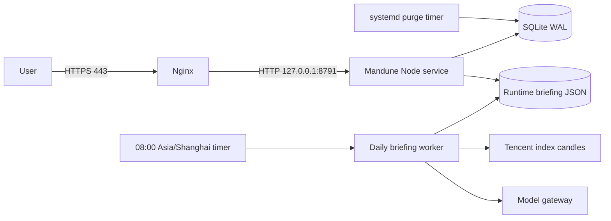

# Deployment

Mandune's maintained production topology is a single Linux host: Nginx terminates HTTPS, one long-running systemd-managed Node.js application process listens on `127.0.0.1:8791`, SQLite stores private state on local disk, and a separate systemd oneshot starts a short-lived Node worker for daily briefing generation.



The complete operator runbook and every supported command live in [`deploy/README.md`](../deploy/README.md). This page summarizes the release contract and the decisions an operator must preserve.

## Host Contract

- Linux with systemd and Nginx.
- Node.js `22.22.1` and pnpm `10.33.2` at explicit persistent paths.
- `curl`, GNU `tar`, `sha256sum`, `sqlite3`, `flock`, `envsubst`, and OpenSSL.
- For the corresponding evidence path: an isolated Python environment with current AKShare for the `stream` primary market source, and Python 3.12 with PandaAI for full `v2` evidence. Tencent remains the credential-free `stream` fallback.
- A DNS name and existing TLS certificate/key.
- Root access for installation, release, and rollback.

Application secrets belong in `/etc/mandong/mandong.env` with mode `0600`. SQLite state and generated briefing JSON belong in `/var/lib/mandong` with no world access. Immutable releases live under `/opt/mandong/releases/<commit-sha>`, while `/opt/mandong/current` points to the active release.

## Release Path

1. Run repository validation with `./deploy/validate.sh`.
2. Build a release archive from a full 40-character commit SHA using `deploy/scripts/create-release.sh`.
3. Transfer the archive and SHA-256 through a protected channel.
4. Run `deploy/scripts/release.sh` with the archive, expected commit, and expected digest.
5. Verify local and public `/health` responses, the current runtime briefing JSON, both systemd timers, the A2A Agent Card when enabled, service state, and listener addresses.

The archive builder exports the named commit into an isolated tree, installs from the lockfile, removes stale output, and normalizes archive metadata. Untracked files in the developer worktree cannot enter the release.

## Transaction and Recovery

Release, rollback, and expiry purge share one bounded `flock` lock. The release transaction:

- rejects absolute paths, dot segments, control characters, links, devices, FIFOs, duplicates, and unexpected archive entries;
- verifies SQLite integrity and creates a consistent pre-migration backup;
- switches the active release symlink only after extraction checks;
- requires `/health` to return the exact candidate SHA;
- restores the previous release and database snapshot if candidate health fails;
- leaves the service stopped when recovery health also fails.

One-step rollback targets only the immediate predecessor. It first snapshots the current live database, tests the old application against the current schema, and restores the original application and guard snapshot if that attempt fails.

## Scheduled jobs

`mandong-purge.timer` runs the compiled maintenance entry point for expired anonymous workspaces. The timer is persistent, randomized, and shares the release lock. The purge service has no network namespace and can write only the application state directory.

`mandong-daily-briefing.timer` runs at 08:00 Asia/Shanghai with up to five minutes of randomized delay. Its oneshot reads the active compiled worker and server-only model configuration, then writes only `/var/lib/mandong/daily-briefings`. The Node service serves that mutable directory before immutable client assets. A failed generation leaves the previous complete `latest/` batch in place.

## Public Sites

The production site is <https://mandune.wuxie233.com>, and the exhibition display is <https://expo.wuxie233.com>. A live URL is not deployment evidence by itself. Before announcing a release, verify:

```sh
curl --fail --silent https://mandune.wuxie233.com/health
curl --fail --silent https://mandune.wuxie233.com/daily-briefings/latest/eastern_observation.json
curl --fail --silent https://mandune.wuxie233.com/.well-known/agent-card.json
curl --fail --silent https://mandune.wuxie233.com/api/metrics/today
curl --fail --silent https://expo.wuxie233.com/mandune-qr.png --output /tmp/mandune-qr.png
sudo systemctl is-active mandong-purge.timer mandong-daily-briefing.timer
sudo systemctl list-timers mandong-purge.timer mandong-daily-briefing.timer
```

Run the browser suite against the exact origin:

```sh
E2E_TARGET_URL=https://mandune.wuxie233.com \
PLAYWRIGHT_CHROMIUM_EXECUTABLE_PATH=/usr/bin/google-chrome \
pnpm test:e2e
```

If A2A is disabled, the Agent Card request is expected to return 404 and should be omitted from acceptance.
